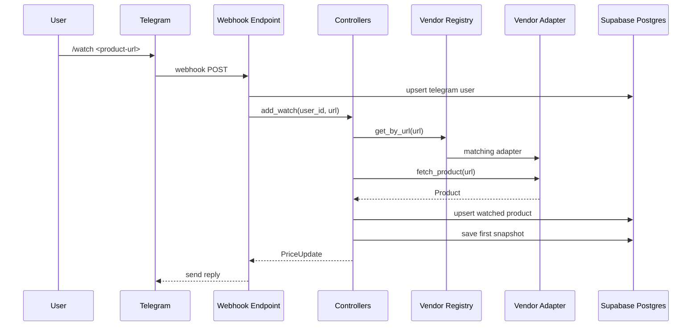
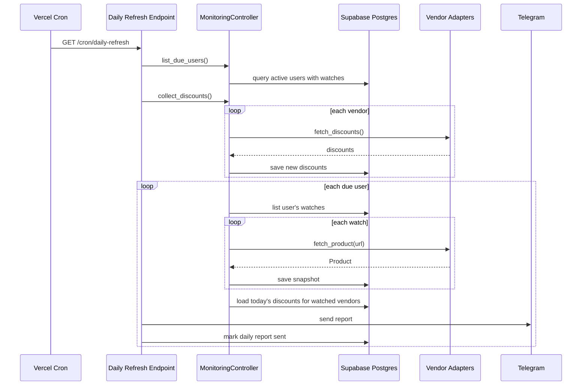
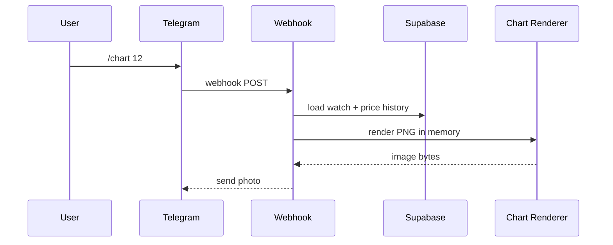

# Architecture

## Deployment model

The app is built for a serverless deployment:

- Telegram sends updates to a webhook endpoint on Vercel
- Vercel invokes Python code in `api/index.py`
- Supabase Postgres stores users, watch lists, prices, and discounts
- Vercel Cron triggers the daily refresh endpoint every 15 minutes
- The app decides which users are actually due based on timezone and last sent date

## Layers

### Layer 1: Services

Each vendor adapter implements the same contract:

- `fetch_product(url) -> Product`
- `fetch_discounts() -> list[Discount]`

Shared responsibilities:

- Browser-like HTTP fetching
- JSON-LD parsing
- HTML metadata parsing
- Promo text extraction

Built-in vendors:

- `zalando`
- `boozt`
- `booztlet`
- `lyko`
- `notino`

Addon vendors can be loaded through `VENDOR_ADDON_MODULES`.

### Layer 2: Controllers

Controllers coordinate vendor fetches with stored users and watches:

- `WatchlistController`
- `MonitoringController`

Responsibilities:

- Detect vendor by URL
- Add or remove a watch for one Telegram user
- Refresh one user’s product list
- Collect discounts
- Build per-user daily reports
- Decide which users are due for a daily message

### Layer 3: Communication

FastAPI endpoints replace the old long-running polling process:

- `/telegram/webhook`
- `/cron/daily-refresh`
- `/chart`
- `/health`

The webhook handler:

- syncs Telegram user info into the database
- parses commands
- returns watch lists only for that user
- generates and sends price charts on demand

## Data model

### TelegramUser

- `telegram_user_id`
- `chat_id`
- `username`
- `first_name`
- `last_name`
- `language_code`
- `timezone`
- `last_daily_report_on`

### WatchingProduct

- `id`
- `telegram_user_id`
- `name`
- `url`
- `vendor_id`
- `active`

### PriceSnapshot

- `watching_product_id`
- `observed_at`
- `product_name`
- `product_price`
- `currency`
- `in_stock`

### Discount

- `vendor_id`
- `code`
- `condition`
- `source_url`

## Request flow

## Daily refresh flow

## Chart flow

